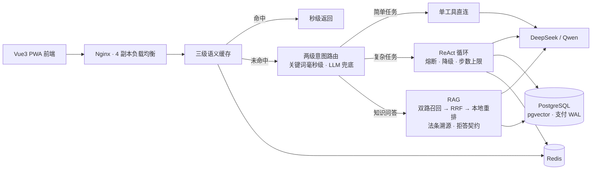

# agent_gateway

个人独立开发并自运维的 Multi-Agent 网关：一套引擎承载旅游规划与民法典咨询两类问答场景，已上线公网（Vue3 PWA 前端 + FastAPI 后端），从需求、编码、部署到线上排障全程一人完成。目前处于小范围内测，真实用户量很小，仓库内出现的性能与评测数字均为自测。

## 亮点

- **一核双用、可插拔架构**：Agent 引擎自研（多 Agent 圆桌协议：并行分析→交叉审阅→仲裁合成），业务属性外置为配置包，新增场景不改引擎代码；两级意图路由，关键词表毫秒级命中、未命中才走模型分类
- **RAG 与评测**：民法典 1260 条约 10 万字全量清洗入库；pg_trgm 关键词 + pgvector 向量双路召回 → RRF 融合 → bge-reranker-base 本地精排（受 1GB 内存约束默认关闭，`LOCAL_RERANK_ENABLED=0`），回答附法条溯源、零召回直接拒答不调模型。190 条人工标注问答集按 train / holdout 切分，重排开启时 holdout Recall@5 93.0%、Recall@10 99.3%、MRR 0.879（自测）
- **前端 v2（Vue3 + TS + Vite）**：自研 SSE 流式分帧器处理跨 chunk 攒帧与结束哨兵、序号守卫防乱序，Pinia 状态管理、DOMPurify 消毒链、PWA 离线壳、移动端适配；vitest 单元与组件测试约 55 用例，Playwright E2E 用例需显式开启、尚未纳入门禁
- **支付体系**：幂等订单 / 分布式锁加乐观锁的钱包扣减 / 流水与订单同事务写入 / 待结算补偿（锁竞争落占位单，维护循环原子结算防双扣）/ 渠道抽象可插拔
- **工程化与运维**：函数与文件行数上限由 AST 脚本校验、密钥扫描与文档防漂移自检挂在脚本门禁上（CI 工作流暂未在本仓库执行，勿当作已通过的门禁）；Alembic 版本化迁移、SLO 与 27 条告警规则、Docker Compose 本地四实例滚动、云端 2 核 1GB 单机跑 lite 栈并以 digest 回滚、备份恢复演练实测 4 秒

## 目录导览

- [showcase/](showcase/README.md) —— 项目展示（给 HR / 招聘方看的完整细则）
- [agent_docs/](agent_docs/修复日志.md) —— **修复台账总入口**（Bug日志 + 全项目总修复日志；各子目录另有同格式 修复日志.md，与代码同址存放）
- [app/](app/) —— 后端核心代码（FastAPI 分层：routes / services / agents / payment / core）
- [frontend/](frontend/) —— 前端 v2 源码（Vue3 + TypeScript + Vite）
- [可复用资产/](可复用资产/) —— 跨项目可复用资产（AI 应用资产 / 前端资产 / harness 模板 / MCP / skill）
- [可复用代码/](可复用代码/) —— 独立机制实现（分布式锁 / 熔断器 / 单飞幂等 / LRU+TTL / 限流器）

## 技术栈

Python · FastAPI · PostgreSQL(pgvector) · Redis · Vue3 · TypeScript · Vite · Docker Compose · Nginx · DeepSeek/Qwen API · 阿里云短信/OSS

## 演示

- 在线演示：https://the-world-agent.cloud

> ℹ️ **同步口径**：本仓为脱敏展示快照（`app/` 等代码同步自私有主仓，2026-09-26 快照）；**修复台账随本仓公开**（[agent_docs/Bug日志.md](agent_docs/Bug日志.md)、[agent_docs/修复日志.md](agent_docs/修复日志.md) 及各目录 修复日志.md，敏感字面量已脱敏）；评测数据与会话历史仍在私有主仓，不随本仓公开。文中引用的 `tests/`、`scripts/`、`deploy/` 等私有工程路径在本仓不存在的，以台账文字为准。
