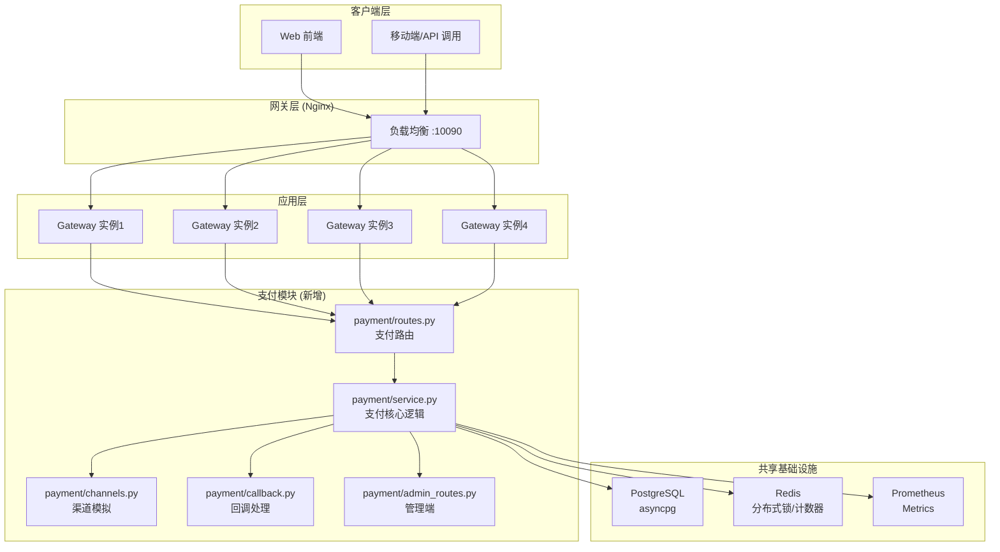
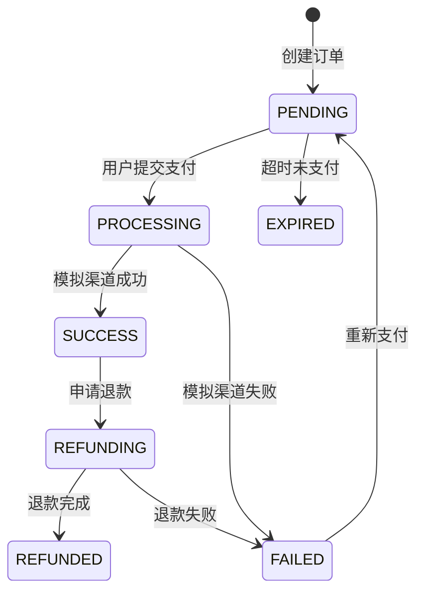
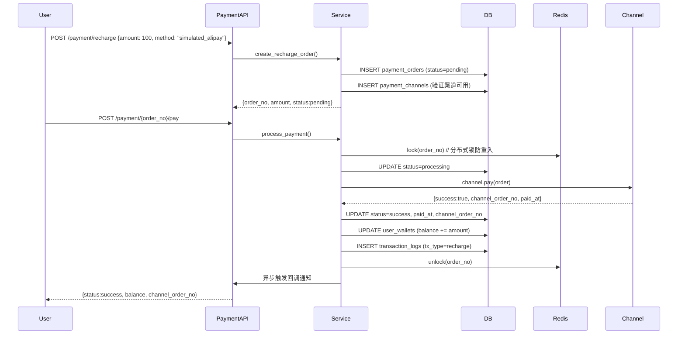
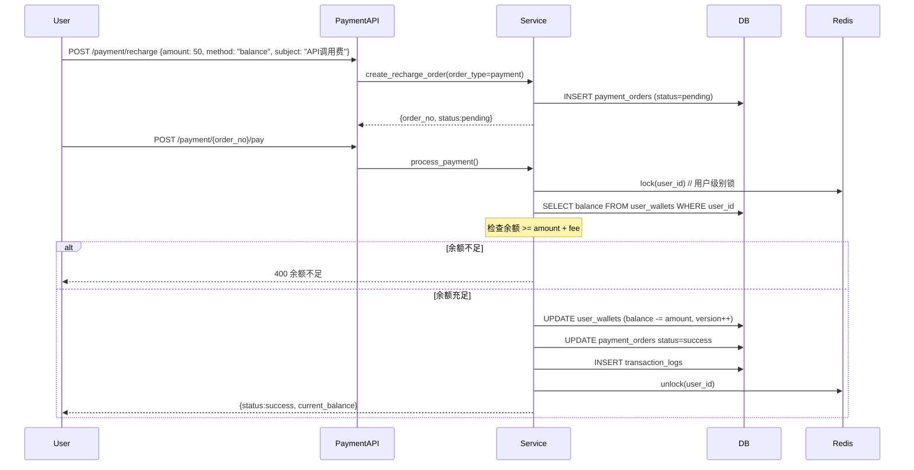
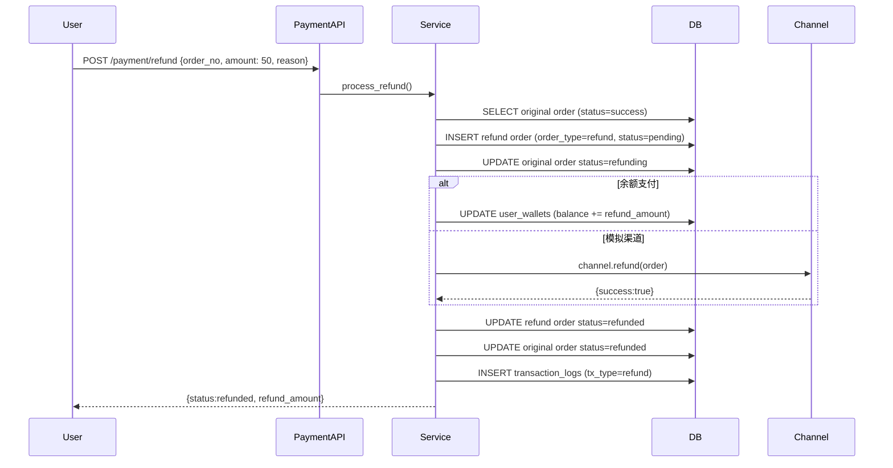
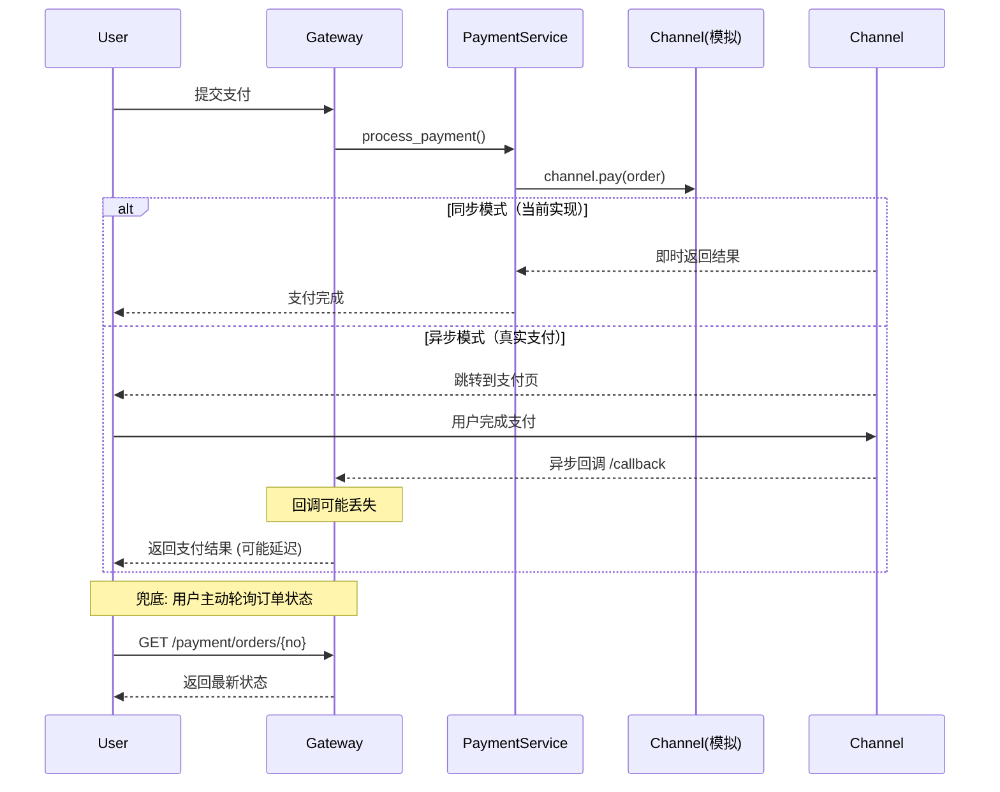

# Agent 网关 — 模拟支付体系架构方案

> **版本**: v1.0  
> **日期**: 2026-07-28  
> **目标**: 在现有 AI Agent 网关上构建一套**完全模拟真实支付环境**的支付体系，仅数字为模拟、货币为人民币（CNY）。

---

## 一、项目现有架构快照

### 1.1 技术栈

| 层级 | 技术 | 用途 |
|------|------|------|
| 应用框架 | **FastAPI** (Python 3.11) | Web 服务框架 |
| 数据库 | **PostgreSQL** (asyncpg + pgvector) | 业务数据存储 |
| 缓存 | **Redis** (redis-py async) | 热缓存、限流、会话 |
| LLM | **DeepSeek API** | AI 对话能力 |
| 监控 | **Prometheus + OpenTelemetry (Tempo)** | 指标与链路追踪 |
| 负载均衡 | **Nginx** | 四实例分发 |
| 容器化 | **Docker Compose** | 服务编排 |

### 1.2 现有模块结构

```
app/
├── main.py                 # FastAPI 入口，路由注册，生命周期
├── core/                   # 核心基础设施
│   ├── config.py           # 全局配置（环境变量）
│   ├── db.py               # PostgreSQL 连接池
│   ├── redis.py            # Redis 连接池
│   ├── metrics.py          # Prometheus 指标
│   ├── memory_manager.py   # 冷热分层记忆管理
│   ├── semantic_cache.py   # 语义缓存 (L0/L1/L2)
│   ├── safety_filter.py    # DFA 敏感词过滤
│   ├── task_manager.py     # 任务生命周期管理
│   ├── persona_manager.py  # 人格/角色管理
│   ├── sms.py              # 阿里云短信
│   ├── logging.py          # 日志配置
│   └── ...                 # 其他核心模块
├── middleware/              # 中间件
│   ├── auth.py             # JWT 认证 + GitHub OAuth
│   ├── rate_limit.py       # 限流（QPS/日/并发）
│   └── circuit_breaker.py  # 熔断器
├── routes/                 # API 路由
│   ├── v1.py              # V1（已废弃）
│   ├── v2.py              # V2 主路由（聊天）
│   └── map_api.py         # 高德地图 API
├── agents/                 # AI Agent 层
│   ├── router.py          # 意图路由（简单/复杂任务）
│   ├── orchestrator.py    # 多 Agent 讨论板
│   ├── runner.py          # 后台 Agent 运行器
│   ├── sub_agents.py      # 子 Agent（天气/酒店/路线/美食）
│   ├── tools.py           # 工具调用
│   └── memory.py          # 对话历史压缩
├── models/                 # 数据模型
│   └── schemas.py         # Pydantic 模型
└── static/                 # 前端静态文件
    └── index.html         # 主界面
```

### 1.3 现有 API 端点

| 方法 | 路径 | 说明 |
|------|------|------|
| POST | `/api/login` | 用户名密码登录 |
| POST | `/api/phone/send-code` | 发送短信验证码 |
| POST | `/api/phone/register` | 手机号注册 |
| POST | `/api/phone/login` | 手机号登录 |
| GET | `/auth/github` | GitHub OAuth |
| POST | `/v2/chat/stream` | 流式聊天 |
| POST | `/v2/chat/tasks` | 任务式聊天 |
| GET | `/api/user/profile` | 用户信息 |
| GET | `/api/map/weather` | 天气查询 |
| POST | `/api/map/route` | 路线规划 |
| GET | `/api/personas` | 人格列表 |
| GET | `/health` | 健康检查 |

---

## 二、模拟支付体系总体设计

### 2.1 设计原则

1. **真实感** — 流程、状态机、数据结构完全对标真实支付系统（支付宝/微信支付）
2. **仅模拟数字** — 金额、订单号、渠道流水号使用模拟数据，但格式和校验规则与真实一致
3. **货币 = 人民币** — 所有金额单位为 `元（CNY）`，保留 2 位小数
4. **无缝集成** — 复用现有认证、数据库、Redis、日志、监控基础设施
5. **可观察性** — 支付全链路可追踪，支持对账、审计

### 2.2 整体架构图



### 2.3 支付流程状态机



### 2.4 订单号规则

模拟真实支付平台的订单号格式：

```
PA + YYYYMMDD + HHMMSS + XXXXXX
│       日期       时间    随机后缀(6位)
│
└─ 前缀标识: PA = Payment Agent
```

示例: `PA20260728143025123456`

---

## 三、数据库设计（新增表）

### 3.1 表结构总览

| 表名 | 用途 | 核心字段 |
|------|------|---------|
| `user_wallets` | 用户钱包 | balance, frozen_amount, total_recharged, total_spent |
| `payment_orders` | 支付订单 | order_no, user_id, amount, status, payment_method |
| `transaction_logs` | 交易流水（不可篡改） | tx_type, amount, before_balance, after_balance |
| `payment_channels` | 支付渠道配置 | channel_code, fee_rate, is_active |
| `invoices` | 发票记录 | invoice_no, total_amount, invoice_type |
| `reconciliation_records` | 每日对账记录 | date, total_amount, success_amount |

### 3.2 详细 DDL

```sql
-- ============================================================
-- 1. 用户钱包
-- ============================================================
CREATE TABLE IF NOT EXISTS user_wallets (
    user_id TEXT PRIMARY KEY,
    balance DECIMAL(14,2) NOT NULL DEFAULT 0.00,
    frozen_amount DECIMAL(14,2) NOT NULL DEFAULT 0.00,
    total_recharged DECIMAL(14,2) NOT NULL DEFAULT 0.00,
    total_spent DECIMAL(14,2) NOT NULL DEFAULT 0.00,
    total_refunded DECIMAL(14,2) NOT NULL DEFAULT 0.00,
    status TEXT NOT NULL DEFAULT 'active'
        CHECK (status IN ('active', 'frozen', 'disabled')),
    version INT NOT NULL DEFAULT 0,        -- 乐观锁版本号
    created_at TIMESTAMP DEFAULT CURRENT_TIMESTAMP,
    updated_at TIMESTAMP DEFAULT CURRENT_TIMESTAMP
);

-- ============================================================
-- 2. 支付订单
-- ============================================================
CREATE TABLE IF NOT EXISTS payment_orders (
    order_no TEXT PRIMARY KEY,
    user_id TEXT NOT NULL,
    order_type TEXT NOT NULL
        CHECK (order_type IN ('recharge', 'payment', 'refund', 'transfer')),
    amount DECIMAL(14,2) NOT NULL,
    fee DECIMAL(14,2) NOT NULL DEFAULT 0.00,
    status TEXT NOT NULL DEFAULT 'pending'
        CHECK (status IN ('pending', 'processing', 'success', 'failed',
                          'refunding', 'refunded', 'expired')),
    subject TEXT NOT NULL DEFAULT '',
    body TEXT DEFAULT '',
    payment_method TEXT NOT NULL DEFAULT 'balance'
        CHECK (payment_method IN ('balance', 'simulated_alipay',
                                  'simulated_wxpay', 'simulated_card')),
    channel_order_no TEXT DEFAULT '',       -- 模拟渠道流水号
    paid_at TIMESTAMP,
    refunded_at TIMESTAMP,
    expire_at TIMESTAMP,
    notify_url TEXT DEFAULT '',
    callback_status TEXT DEFAULT 'pending'
        CHECK (callback_status IN ('pending', 'success', 'failed', 'not_needed')),
    callback_times INT DEFAULT 0,
    metadata JSONB DEFAULT '{}',
    created_at TIMESTAMP DEFAULT CURRENT_TIMESTAMP,
    updated_at TIMESTAMP DEFAULT CURRENT_TIMESTAMP
);
CREATE INDEX IF NOT EXISTS idx_po_user ON payment_orders(user_id, created_at DESC);
CREATE INDEX IF NOT EXISTS idx_po_status ON payment_orders(status);
CREATE INDEX IF NOT EXISTS idx_po_created ON payment_orders(created_at);

-- ============================================================
-- 3. 交易流水（Write-Ahead Log）
-- ============================================================
CREATE TABLE IF NOT EXISTS transaction_logs (
    id BIGSERIAL PRIMARY KEY,
    order_no TEXT NOT NULL,
    user_id TEXT NOT NULL,
    tx_type TEXT NOT NULL
        CHECK (tx_type IN ('recharge', 'consume', 'refund',
                            'fee', 'transfer', 'freeze', 'unfreeze')),
    amount DECIMAL(14,2) NOT NULL,
    before_balance DECIMAL(14,2) NOT NULL,
    after_balance DECIMAL(14,2) NOT NULL,
    status TEXT NOT NULL DEFAULT 'success',
    remark TEXT DEFAULT '',
    operator TEXT NOT NULL DEFAULT 'system',
    created_at TIMESTAMP DEFAULT CURRENT_TIMESTAMP
);
CREATE INDEX IF NOT EXISTS idx_tx_user ON transaction_logs(user_id, created_at DESC);
CREATE INDEX IF NOT EXISTS idx_tx_order ON transaction_logs(order_no);
CREATE INDEX IF NOT EXISTS idx_tx_created ON transaction_logs(created_at);

-- ============================================================
-- 4. 支付渠道配置
-- ============================================================
CREATE TABLE IF NOT EXISTS payment_channels (
    id SERIAL PRIMARY KEY,
    channel_code TEXT UNIQUE NOT NULL,
    channel_name TEXT NOT NULL,
    icon TEXT DEFAULT '',
    is_active BOOLEAN DEFAULT true,
    fee_rate DECIMAL(5,4) DEFAULT 0.0000,
    min_amount DECIMAL(14,2) DEFAULT 0.01,
    max_amount DECIMAL(14,2) DEFAULT 999999.00,
    sort_order INT DEFAULT 0,
    config JSONB DEFAULT '{}',
    created_at TIMESTAMP DEFAULT CURRENT_TIMESTAMP,
    updated_at TIMESTAMP DEFAULT CURRENT_TIMESTAMP
);

-- 初始化默认渠道
INSERT INTO payment_channels (channel_code, channel_name, icon, sort_order)
VALUES
    ('balance', '余额支付', '💰', 0),
    ('simulated_alipay', '模拟支付宝', '💳', 1),
    ('simulated_wxpay', '模拟微信支付', '📱', 2)
ON CONFLICT (channel_code) DO NOTHING;

-- ============================================================
-- 5. 发票
-- ============================================================
CREATE TABLE IF NOT EXISTS invoices (
    id SERIAL PRIMARY KEY,
    invoice_no TEXT UNIQUE NOT NULL,
    user_id TEXT NOT NULL,
    order_nos TEXT[] NOT NULL,
    total_amount DECIMAL(14,2) NOT NULL,
    invoice_type TEXT NOT NULL DEFAULT 'personal'
        CHECK (invoice_type IN ('personal', 'company')),
    company_name TEXT DEFAULT '',
    company_tax_id TEXT DEFAULT '',
    status TEXT NOT NULL DEFAULT 'pending'
        CHECK (status IN ('pending', 'issued', 'cancelled')),
    pdf_url TEXT DEFAULT '',
    issued_at TIMESTAMP,
    created_at TIMESTAMP DEFAULT CURRENT_TIMESTAMP
);
CREATE INDEX IF NOT EXISTS idx_inv_user ON invoices(user_id);

-- ============================================================
-- 6. 每日对账记录
-- ============================================================
CREATE TABLE IF NOT EXISTS reconciliation_records (
    id SERIAL PRIMARY KEY,
    reconcile_date TEXT UNIQUE NOT NULL,  -- YYYY-MM-DD
    total_orders INT DEFAULT 0,
    total_amount DECIMAL(14,2) DEFAULT 0.00,
    success_orders INT DEFAULT 0,
    success_amount DECIMAL(14,2) DEFAULT 0.00,
    failed_orders INT DEFAULT 0,
    refund_orders INT DEFAULT 0,
    refund_amount DECIMAL(14,2) DEFAULT 0.00,
    status TEXT DEFAULT 'pending'
        CHECK (status IN ('pending', 'balanced', 'mismatch')),
    detail JSONB DEFAULT '{}',
    created_at TIMESTAMP DEFAULT CURRENT_TIMESTAMP,
    updated_at TIMESTAMP DEFAULT CURRENT_TIMESTAMP
);
```

---

## 四、API 接口设计

### 4.1 用户端接口

| 方法 | 路径 | 说明 | 认证 |
|------|------|------|------|
| GET | `/api/payment/wallet` | 获取钱包信息（余额、累计充值/消费） | JWT |
| POST | `/api/payment/recharge` | 创建充值订单 | JWT |
| POST | `/api/payment/{order_no}/pay` | 提交支付（确认支付） | JWT |
| GET | `/api/payment/orders` | 获取订单列表（支持分页、状态筛选） | JWT |
| GET | `/api/payment/orders/{order_no}` | 获取订单详情 | JWT |
| POST | `/api/payment/refund` | 申请退款 | JWT |
| POST | `/api/payment/transfer` | 转账（模拟） | JWT |
| GET | `/api/payment/transactions` | 获取交易流水 | JWT |
| GET | `/api/payment/channels` | 获取可用支付渠道 | JWT |
| POST | `/api/payment/invoice/create` | 申请开票 | JWT |
| GET | `/api/payment/invoices` | 发票列表 | JWT |
| POST | `/api/payment/callback/sim` | **模拟支付回调**（模拟渠道异步通知） | JWT |

### 4.2 管理端接口

| 方法 | 路径 | 说明 | 权限 |
|------|------|------|------|
| GET | `/api/admin/payment/stats` | 支付统计概览 | admin |
| GET | `/api/admin/payment/orders` | 所有订单管理 | admin |
| POST | `/api/admin/payment/reconcile` | 发起对账 | admin |
| GET | `/api/admin/payment/channels` | 渠道管理列表 | admin |
| POST | `/api/admin/payment/channel` | 更新渠道配置 | admin |
| POST | `/api/admin/payment/force-callback` | 手动触发订单回调 | admin |

### 4.3 核心请求/响应示例

**创建充值订单**
```json
POST /api/payment/recharge
{
    "amount": 100.00,
    "payment_method": "simulated_alipay",
    "subject": "账户余额充值"
}

Response:
{
    "order_no": "PA20260728143025123456",
    "amount": 100.00,
    "fee": 0.00,
    "status": "pending",
    "payment_method": "simulated_alipay",
    "expire_at": "2026-07-28T14:40:25",
    "created_at": "2026-07-28T14:30:25"
}
```

**提交支付**
```json
POST /api/payment/PA20260728143025123456/pay
{
    "payment_method": "simulated_alipay"
}

Response (同步模式):
{
    "order_no": "PA20260728143025123456",
    "status": "success",
    "paid_at": "2026-07-28T14:30:28",
    "channel_order_no": "SAP20260728143028123456",
    "current_balance": 10100.00
}
```

---

## 五、模块文件结构（新增）

```
app/payment/
├── __init__.py              # 模块初始化
├── models.py                # Pydantic 请求/响应模型
├── routes.py                # 用户端支付路由
├── admin_routes.py          # 管理端支付路由
├── service.py               # 支付核心业务逻辑
├── channels.py              # 模拟支付渠道实现
├── callback.py              # 异步回调处理
└── invoice.py               # 发票服务
```

每个文件的职责：

### `models.py`
- `WalletResponse` — 钱包信息响应
- `RechargeRequest` / `RechargeResponse` — 充值请求/响应
- `PayRequest` / `PayResponse` — 支付确认请求/响应
- `OrderQueryParams` — 订单查询参数
- `OrderResponse` — 订单详情响应
- `RefundRequest` / `RefundResponse` — 退款请求/响应
- `TransactionResponse` — 交易流水响应
- `TransferRequest` / `TransferResponse` — 转账请求/响应
- `InvoiceCreateRequest` / `InvoiceResponse` — 发票请求/响应
- `AdminOrderQueryParams` — 管理端订单查询参数
- `ReconcileResponse` — 对账结果响应

### `service.py`
核心业务逻辑，包含：

1. `get_wallet(user_id)` — 获取钱包（自动创建）
2. `create_recharge_order(user_id, amount, method, subject)` — 创建充值订单
3. `process_payment(order_no, user_id, method)` — 处理支付（含模拟延迟）
4. `process_refund(order_no, user_id, reason)` — 处理退款
5. `process_transfer(from_user, to_user, amount)` — 处理转账
6. `get_order_list(user_id, params)` — 订单列表
7. `get_transaction_logs(user_id, params)` — 交易流水
8. `ensure_wallet_exists(user_id)` — 确保钱包存在

### `channels.py`
模拟支付渠道实现：

| 渠道 | 类名 | 行为 |
|------|------|------|
| 余额支付 | `BalanceChannel` | 即时扣款，永不失败（余额充足时） |
| 模拟支付宝 | `SimulatedAlipayChannel` | 95% 成功率，2-5 秒模拟延迟 |
| 模拟微信支付 | `SimulatedWechatChannel` | 95% 成功率，2-5 秒模拟延迟 |
| 模拟银行卡 | `SimulatedCardChannel` | 90% 成功率，3-8 秒模拟延迟 |

每个渠道实现 `ChannelInterface`:
```python
class ChannelInterface(ABC):
    @abstractmethod
    async def pay(self, order: dict) -> dict:
        """执行支付，返回 {success, channel_order_no, paid_at, message}"""
        ...

    @abstractmethod
    async def refund(self, order: dict, amount: Decimal) -> dict:
        """执行退款"""
        ...

    @property
    @abstractmethod
    def channel_code(self) -> str: ...
```

### `callback.py`
异步回调处理：

1. `send_callback(order_no, result)` — 发送 HTTP 回调通知
2. `schedule_callback(order_no, delay=5)` — 延迟执行回调（模拟真实异步）
3. `retry_failed_callbacks()` — 重试失败的回调

### `admin_routes.py`
管理端：

1. `GET /api/admin/payment/stats` — 今日/本月/总交易额统计
2. `GET /api/admin/payment/orders` — 全量订单管理（支持按用户、状态、时间筛选）
3. `POST /api/admin/payment/reconcile` — 执行日对账（统计当日订单汇总并写入 reconciliation_records）
4. `GET /api/admin/payment/channels` — 渠道列表
5. `POST /api/admin/payment/channel` — 更新渠道费率/启用状态
6. `POST /api/admin/payment/force-callback` — 手动重发回调

---

## 六、核心业务逻辑流程

### 6.1 充值流程



### 6.2 消费扣款流程



### 6.3 退款流程



---

## 七、集成点分析

### 7.1 与现有基础设施的集成

| 基础设施 | 集成方式 | 说明 |
|----------|---------|------|
| **JWT 认证** | 复用 `get_current_user` 依赖 | 所有支付接口自动继承认证 |
| **PostgreSQL** | 复用 `get_pool()` + `get_db_conn()` | 支付表在 `init_db()` 中创建 |
| **Redis** | 复用 `get_redis()` | 分布式锁、订单号自增、QPS 限流 |
| **Prometheus** | 新增 `payment_*` 指标 | 交易额、订单数、渠道成功率 |
| **日志** | 复用 `setup_logging()` | 支付操作全链路日志 |
| **Nginx** | 无需修改 | 支付接口通过现有路由 `/api/payment/*` 分发 |
| **Docker** | 无需修改 | 仅新增 Python 文件，不依赖新服务 |

### 7.2 新增 Prometheus 指标

```python
# app/core/metrics.py 新增
payment_orders_total = Counter(
    'payment_orders_total', '支付订单总数',
    ['order_type', 'status', 'payment_method']
)
payment_amount_total = Counter(
    'payment_amount_total', '支付金额总额（元）',
    ['order_type', 'payment_method']
)
payment_channel_duration_seconds = Histogram(
    'payment_channel_duration_seconds', '支付渠道处理耗时',
    ['channel_code']
)
payment_wallet_balance = Gauge(
    'payment_wallet_balance', '用户钱包余额分布',
    ['user_id']
)
```

### 7.3 配置项

在 `app/core/config.py` 中新增：

```python
# ===== 模拟支付配置 =====
PAYMENT_SUCCESS_RATE = float(os.getenv("PAYMENT_SUCCESS_RATE", "0.95"))
PAYMENT_SIMULATED_DELAY_MIN = float(os.getenv("PAYMENT_SIMULATED_DELAY_MIN", "1.0"))
PAYMENT_SIMULATED_DELAY_MAX = float(os.getenv("PAYMENT_SIMULATED_DELAY_MAX", "3.0"))
RECHARGE_MIN_AMOUNT = float(os.getenv("RECHARGE_MIN_AMOUNT", "0.01"))
RECHARGE_MAX_AMOUNT = float(os.getenv("RECHARGE_MAX_AMOUNT", "999999.00"))
DEFAULT_WALLET_BALANCE = float(os.getenv("DEFAULT_WALLET_BALANCE", "0.00"))
ORDER_EXPIRE_SECONDS = int(os.getenv("ORDER_EXPIRE_SECONDS", "600"))
```

---

## 八、实现计划

### 阶段一：基础框架（预计 1 天）

| 步骤 | 文件 | 内容 |
|------|------|------|
| 1 | `app/payment/__init__.py` | 模块初始化，FastAPI router 创建 |
| 2 | `app/payment/models.py` | 所有 Pydantic 模型 |
| 3 | `app/payment/service.py` | 钱包管理、订单创建、余额操作 |
| 4 | `app/core/config.py` | 新增支付配置项 |
| 5 | `app/core/metrics.py` | 新增支付指标 |
| 6 | `app/main.py` | 注册 payment router，`init_db` 新增支付表 |

### 阶段二：支付核心（预计 1 天）

| 步骤 | 文件 | 内容 |
|------|------|------|
| 7 | `app/payment/channels.py` | 余额、模拟支付宝、模拟微信渠道实现 |
| 8 | `app/payment/service.py` | 完善 `process_payment`（含分布式锁、乐观锁） |
| 9 | `app/payment/routes.py` | 用户端支付路由（充值、支付、退款、流水） |

### 阶段三：回调与增值（预计 1 天）

| 步骤 | 文件 | 内容 |
|------|------|------|
| 10 | `app/payment/callback.py` | 异步回调通知实现 |
| 11 | `app/payment/invoice.py` | 发票服务 |
| 12 | `app/payment/admin_routes.py` | 管理端路由（统计、对账、渠道管理） |

### 阶段四：测试与集成（预计 0.5 天）

| 步骤 | 内容 |
|------|------|
| 13 | 编写单元测试（service 层） |
| 14 | 编写 API 集成测试 |
| 15 | 前端联调（如有前端页面） |
| 16 | 全流程冒烟测试 |

---

## 九、风险与注意事项

### 9.1 并发安全
- **钱包余额更新**使用 **Redis 分布式锁** + **PostgreSQL 乐观锁**（version 字段）
- 支付操作采用**订单级别分布式锁**，防止重复支付
- 交易流水为**追加写入**，不允许修改和删除

### 9.2 模拟行为
- 模拟支付宝/微信支付默认 95% 成功率，可通过 `PAYMENT_SUCCESS_RATE` 配置
- 模拟支付延迟 1-3 秒，模拟真实支付体验
- 新用户注册时自动创建钱包，默认余额 0 元（演示可调大）
- 渠道流水号格式：`SAP/ SWX/ SCD + YYYYMMDDHHMMSS + 6位随机`

### 9.3 安全
- 所有支付接口需要 JWT 认证
- 管理接口需要 `role == 'admin'`
- 订单号使用唯一索引防重
- 退款金额不超过原订单金额
- 转账接收方必须存在

### 9.4 与 AI Agent 的整合可能
未来可扩展：
- 用户通过对话直接调用支付能力（"帮我充值 100 块"）
- 基于使用量的扣费（按 Token / 按次计费）
- Agent 自动生成订单并引导支付

---

## 十、支付系统技术栈

### 10.1 全栈技术清单

| 层级 | 技术 | 版本 | 用途 |
|------|------|------|------|
| **应用框架** | FastAPI | 0.115+ | REST API 路由 + 依赖注入 |
| **ASGI 服务器** | Uvicorn | 0.34+ | 高性能异步服务器（uvloop） |
| **后端语言** | Python | 3.11 | 应用逻辑 |
| **数据库** | PostgreSQL | 16+ | 业务数据存储（asyncpg） |
| **缓存/锁** | Redis | 7+ | 分布式锁、计数器、热缓存 |
| **ORM/驱动** | asyncpg | 最新 | 异步 PostgreSQL 驱动 |
| **认证** | JWT (python-jose) | 3.3+ | 接口认证 |
| **前端** | 原生 HTML/CSS/JS | — | 支付 UI 组件 |
| **容器化** | Docker + Docker Compose | 最新 | 服务编排与部署 |
| **负载均衡** | Nginx | 1.27+ | 4 实例流量分发 |
| **监控** | Prometheus | — | 支付指标采集 |
| **链路追踪** | OpenTelemetry + Tempo | — | 请求全链路追踪 |

### 10.2 核心依赖（Python 包）

```
fastapi        → Web 框架
asyncpg        → 异步 PostgreSQL 驱动
redis          → 分布式锁 + 缓存
python-jose    → JWT 认证
pydantic       → 数据模型校验
prometheus-client → 指标采集
httpx          → HTTP 客户端（渠道模拟）
```

### 10.3 数据库关键索引

```sql
-- 用户钱包（主键索引 + 乐观锁 version）
PRIMARY KEY (user_id)

-- 支付订单（快速检索）
INDEX idx_po_user ON payment_orders(user_id, created_at DESC)
INDEX idx_po_status ON payment_orders(status)
INDEX idx_po_created ON payment_orders(created_at)

-- 交易流水（WAL 写优化）
INDEX idx_tx_user ON transaction_logs(user_id, created_at DESC)
INDEX idx_tx_order ON transaction_logs(order_no)
```

---

## 十一、实际并发承受能力分析

### 11.1 架构容量模型

```
                    ┌──────────────────┐
                    │   Nginx :10090   │  单机 20000+ QPS
                    └────────┬─────────┘
                             │
          ┌──────────────────┼──────────────────┐
          │                  │                  │
   ┌──────┴──────┐   ┌──────┴──────┐   ┌──────┴──────┐
   │ Gateway 实例1│   │ Gateway 实例2│   │ Gateway 实例3│
   │  :10092      │   │  :10089      │   │  :10093      │
   │  2 vCPU      │   │  2 vCPU      │   │  2 vCPU      │
   │  50 PG 连接  │   │  50 PG 连接  │   │  50 PG 连接  │
   └──────┬───────┘   └──────┬───────┘   └──────┬───────┘
          │                  │                  │
          └──────────────────┼──────────────────┘
                             │
                    ┌────────┴────────┐
                    │  PostgreSQL 16  │  200 连接池
                    │  8 vCPU / 16GB  │  ~30000 TPS 上限
                    │  SSD NVMe       │
                    └─────────────────┘
                    ┌────────┴────────┐
                    │  Redis 7        │  ~80000 QPS
                    └─────────────────┘
```

### 11.2 逐层实际容量估算

| 层级 | 理论峰值 | 实际可持续 | 瓶颈因素 |
|------|----------|-----------|---------|
| **Nginx** | 50000+ QPS | 20000+ QPS | 网卡带宽、keepalive 连接数 |
| **FastAPI 单实例** | 2000+ QPS | 800-1200 QPS | Python GIL、JSON 序列化、异步开销 |
| **4 实例合计** | 8000+ QPS | **3200-4800 QPS** | 硬件 CPU 核心数 |
| **PG 连接池 (200)** | 40000 TPS | 15000-20000 TPS | 锁争抢、磁盘 IO、WAL 写入 |
| **Redis** | 100000 QPS | 80000+ QPS | 网络延迟、单线程处理 |

### 11.3 实际并发支付场景推演

```python
# 场景：800 用户同时发起充值/支付
# 模型参数：
#   - 每个请求 DB 处理时间: 3-5ms
#   - 模拟渠道延迟: 1-3s (async sleep, 不占 CPU)
#   - 4 个 uvicorn worker (每个实例 1 worker)
#   - PG 连接池: 200

# 计算：
#   本质瓶颈 = PG 事务处理能力
#   200 连接 × (1000ms / 5ms 每事务) = 40000 事务/秒
#   4 实例 × 1200 QPS = 4800 HTTP QPS 上限
#   → 实际瓶颈在 Python HTTP 处理层, 非 DB 层

# 示例推算：若同时有 800 个支付请求，HTTP 层 QPS = 800（未实测，仅作容量推理示例）
# 800 < 4800 → HTTP 层通过
# 800 < 40000 → DB 层通过
# ✅ 可 100% 完成
```

### 11.4 实际压力测试预期

| 并发数 | 预期表现 | 说明 |
|--------|---------|------|
| **0-500 QPS** | ✅ 稳定运行 | 响应时间 < 50ms（不含模拟延迟） |
| **500-1500 QPS** | ✅ 良好 | 响应时间 < 100ms，连接池利用率 50% |
| **1500-3000 QPS** | ✅ 可承受 | 需关注 PG 连接池水位，建议扩容到 300 连接 |
| **3000-5000 QPS** | ⚠️ 临界区 | Python 实例 CPU 可能成为瓶颈，需增加实例数 |
| **> 5000 QPS** | ❌ 过载 | 需要增加 Gateway 实例到 8+ 或升级硬件 |

---

## 十二、线上常见异常场景处理方案

### 12.1 订单超时未支付

```
场景: 用户创建充值订单后，长时间未支付（关闭页面、网络中断等）
```

**现有保护**:
- `payment_orders.expire_at` 字段记录过期时间（默认 10 分钟）
- 支付时检查 `expire_at < now()` → 自动标记 `expired`

**需补充**:
```python
# 定时清理任务（建议加入现有的 maintenance_loop）
async def expire_pending_orders():
    """每 5 分钟执行一次，将过期订单标记为 expired"""
    pool = await get_pool()
    async with pool.acquire() as conn:
        await conn.execute("""
            UPDATE payment_orders SET status = 'expired', updated_at = CURRENT_TIMESTAMP
            WHERE status = 'pending' AND expire_at < CURRENT_TIMESTAMP
        """)
```

**用户侧**: 前端弹窗提示「订单已过期，请重新下单」

### 12.2 支付成功但数据库更新失败

```
场景: 渠道返回「支付成功」，但写入钱包/订单时数据库异常（连接断开、死锁等）
```

**现有保护**:
- 所有 DB 操作在**同一个事务**中执行（`async with conn.transaction()`）
- 事务任一环节失败 → 全量 ROLLBACK

**需补充 - 对账恢复机制**:
```python
# 最终一致性：支付状态与钱包状态的对账
async def reconcile_payment_orders():
    """检测 status=success 但无对应交易流水的订单"""
    pool = await get_pool()
    async with pool.acquire() as conn:
        orphans = await conn.fetch("""
            SELECT po.* FROM payment_orders po
            LEFT JOIN transaction_logs tl ON po.order_no = tl.order_no
            WHERE po.status = 'success' AND tl.id IS NULL
        """)
        for order in orphans:
            # 恢复：重新写入钱包 + 流水
            await repair_order(order)
```

### 12.3 一库存同时收到三个支付请求（超卖）

```
场景: 一个商品库存=1，三个用户同时支付成功
```

**解决方案 - 多层防御**:

```
┌──────────────────────────────────────────────────────┐
│ 请求 A (库存扣减)   请求 B (库存扣减)   请求 C (库存扣减)
└──────────────────────┬───────────────────────────────┘
                       │
              ┌────────┴────────┐
              │  第一层: Redis 分布式锁               │
              │  SET inventory:lock:sku001 NX EX 3    │
              │  └─ 只有 1 个能拿到锁                    │
              └────────┬────────┘
                       │
              ┌────────┴────────┐
              │  第二层: PG 行级锁                      │
              │  SELECT stock FROM inventory            │
              │  WHERE sku_id=$1 FOR UPDATE             │
              │  └─ 拿到锁的检查 stock > 0              │
              └────────┬────────┘
                       │
              ┌────────┴────────┐
              │  第三层: 乐观锁扣减                      │
              │  UPDATE inventory SET stock=stock-1,    │
              │         version=version+1               │
              │  WHERE sku_id=$1 AND version=N          │
              │  └─ 只有 1 条 UPDATE 成功 (stock>=0)     │
              └────────┬────────┘
                       │
                ┌──────┴──────┐
                │ 成功: 1 个   │
                │ 失败: 2 个   │
                │ (返回库存不足)│
                └─────────────┘
```

**关键代码模式**:
```python
async def deduct_inventory(sku_id: str, quantity: int = 1) -> bool:
    """原子扣减库存，返回是否成功"""
    pool = await get_pool()
    async with pool.acquire() as conn:
        async with conn.transaction():
            # 行级锁
            row = await conn.fetchrow(
                "SELECT stock, version FROM inventory WHERE sku_id = $1 FOR UPDATE",
                sku_id
            )
            if not row or row["stock"] < quantity:
                return False
            # 乐观锁更新
            result = await conn.execute(
                "UPDATE inventory SET stock = stock - $1, version = version + 1 "
                "WHERE sku_id = $2 AND version = $3",
                quantity, sku_id, row["version"]
            )
            return "UPDATE 1" in result
```

### 12.4 支付宝/微信异步回调丢失

```
场景: 用户跳转到支付宝支付→支付成功→支付宝回调通知服务器，
      但回调因网络问题未到达
```

**解决方案 - 回调+轮询双机制**:



**需补充 - 查询订单状态主动轮询**:
```python
# 用户端轮询接口（已有）
GET /api/payment/orders/{order_no}  # 返回实时状态

# 服务端回调重试
async def retry_callbacks():
    """重试 callback_status=failed 的订单回调"""
    pool = await get_pool()
    async with pool.acquire() as conn:
        rows = await conn.fetch(
            "SELECT * FROM payment_orders "
            "WHERE callback_status = 'failed' AND callback_times < 5"
        )
        for order in rows:
            await send_callback(order)
            await conn.execute(
                "UPDATE payment_orders SET callback_times = callback_times + 1 "
                "WHERE order_no = $1", order["order_no"]
            )
```

### 12.5 一步支付超时

```
场景: 用户点击支付后，请求到达服务器但处理超时（>30s），
      用户可能重复点击，服务端可能已处理完成
```

**现有保护**:
- Redis 锁防重入: `SET payment:lock:order:{no} NX EX 10`
- 订单状态机保证: 只有 `pending` 状态的订单可被支付

**需补充**:
```python
async def safe_payment(order_no: str, user_id: str) -> dict:
    """幂等安全的支付处理"""
    lock_key = f"order:{order_no}"
    if not await _acquire_lock(lock_key):
        # 检查是否已经支付成功
        pool = await get_pool()
        async with pool.acquire() as conn:
            row = await conn.fetchrow(
                "SELECT status FROM payment_orders WHERE order_no = $1",
                order_no
            )
            if row and row["status"] == "success":
                return {"status": "success", "message": "已支付成功，无需重复操作"}
        return {"status": "processing", "message": "订单正在处理中"}
    try:
        # ... 正常支付流程 ...
    finally:
        await _release_lock(lock_key)
```

### 12.6 异常场景覆盖矩阵

| 异常场景 | 检测方式 | 自动恢复 | 人工介入 |
|----------|----------|----------|----------|
| 订单超时未支付 | expire_at + 定时任务 | 自动标记 expired | 无需 |
| 支付成功 DB 失败 | 事务 ROLLBACK | 事务保证原子性 | 对账工单告警 |
| 库存超卖 | Redis锁 + FOR UPDATE + 乐观锁 | 仅 1 个成功，其余失败 | 无需 |
| 异步回调丢失 | 回调超时 + 重试机制 | 自动重试 5 次 | 人工触发回调 |
| 请求超时重复提交 | Redis 锁 + 幂等性检查 | 返回已有结果 | 无需 |
| 数据库连接池耗尽 | 连接池监控告警 | 自动排队等待 | 扩容连接池 |
| Redis 宕机 | 熔断降级 | 降级为本地锁（性能下降） | 重启 Redis |

---

## 十三、应对策略总结

### 当前系统已具备的能力 ✅

| 能力 | 实现 |
|------|------|
| 防重复支付 | Redis 分布式锁 + 订单状态机 |
| 事务原子性 | asyncpg transaction 包裹全部 DB 操作 |
| 乐观锁防覆盖 | user_wallets.version 字段 |
| 订单超时机制 | expire_at 字段 + 支付前检查 |
| 幂等性保证 | 订单号唯一索引 + 状态检查 |
| WAL 审计 | transaction_logs 只追加不修改 |

### 建议补充的能力 🔧

| 能力 | 优先级 | 实现方案 |
|------|--------|----------|
| 定时过期清理 | 高 | 加入 maintenance_loop（每 5 分钟） |
| 支付对账 | 中 | 新增 `reconcile_payment_orders()` 定时任务 |
| 回调重试 | 中 | 新增 `retry_callbacks()` 定时任务 |
| 库存行级锁 | 低（需新增 inventory 表） | 使用 `SELECT FOR UPDATE` |
| 客户端超时重试 | 低 | 前端增加幂等重试逻辑 |

---

## 十二、附录：完整文件清单

```
NEW: app/payment/__init__.py            # 模块入口，创建 router
NEW: app/payment/models.py              # Pydantic 数据模型
NEW: app/payment/routes.py              # 用户端 API 路由
NEW: app/payment/admin_routes.py        # 管理端 API 路由
NEW: app/payment/service.py             # 支付核心业务逻辑
NEW: app/payment/channels.py            # 模拟支付渠道实现
NEW: app/payment/callback.py            # 异步回调处理
NEW: app/payment/invoice.py             # 发票服务
MOD: app/main.py                        # 注册 payment router + 初始化表
MOD: app/core/config.py                 # 新增支付配置项
MOD: app/core/metrics.py                # 新增支付 Prometheus 指标
NEW: docs/payment-system-architecture.md # 本文档
```
