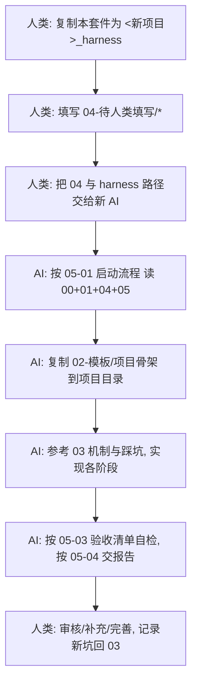

# Harness — 新项目启动套件

> 本套件是**新项目的启动装置**。它把「一个生产级项目该有的骨架、规则、机制、
> 踩坑」打包成多文件夹结构，让一个**全新的 AI** 在拿到「项目协议」后，能自主
> 完成 80% 以上的开发工作，再由人来审核、补充、完善。
>
> **▶ 开始之前，先读 `00-主人意图与使用方法.md`** ——那是主人的意图与期望，
> 是所有后来 AI 必读的第一份文件。

---

## 一、这是什么

一份**参考 + 规则 + 模板 + 执行协议**的集合，基于 agent_gateway 生产实战沉淀，
但**对任何新项目通用**。不是某个项目的设计书，而是「生成项目设计书和执行过程」的装置。

## 二、文件夹结构（谁负责什么）

| 文件夹 | 内容 | 谁负责 |
|---|---|---|
| `00-README.md` | 本文件：使用方式与阅读顺序 | 人 + AI 都读 |
| `01-规则/` | **AI 必须遵守的硬规则**（工作规则 / 编码安全 / 防熵机制） | AI 遵守，人维护 |
| `02-模板/` | 可复制的项目骨架与关键模板文件 | AI 复制，人审 |
| `03-参考-项目经验/` | agent_gateway 实战经验（**参考，不是规则**） | AI 参考，人维护 |
| `04-待人类填写/` | **必须由人填写的项目专属内容**（协议/业务/MVP/凭据） | **人类填写**，AI 只读不猜 |
| `05-执行流程/` | AI 长链任务的执行协议、验收清单、报告模板 | AI 执行，人验收 |

## 三、使用流程（新项目启动）

## 四、角色分工

**人类负责**（AI 禁止代劳/猜测）：
- 填写 `04-待人类填写/`：端口、协议、错误码、业务定义、MVP 范围、外部凭据
- 提供关键业务决策（领域模型、核心流程）
- 最终审核与上线

**AI 负责**（人类不必重复）：
- 按规则搭建骨架、实现分层代码
- 落地通用机制（认证/限流/熔断/缓存/幂等/迁移）
- 自测 + 对照验收清单 + 输出结构化报告
- 发现协议/业务不明 → **停下询问**，绝不编造

## 五、阅读顺序（给新 AI 的第一条指令）

0. **OpenCode 等代理进目录会自动读 `AGENTS.md`**（行为契约入口，见 `99-OpenCode使用指南.md`）
1. 读 `00-主人意图与使用方法.md`（主人的意图与期望——**必读第一份**）
2. 读本文件 `00-README.md`
3. 读 `01-规则/00-工作规则.md`（先建立行为约束）
4. 读 `04-待人类填写/` 全部（这是项目事实，是唯一准绳）
5. 读 `05-执行流程/01-启动流程.md`（知道接下来怎么做）
6. 过程中按需查阅 `01-规则/*`（规范）与 `03-参考-项目经验/*`（参考）

## 六、目标

新项目从零到「可运行 + 有验收 + 有报告」由 AI 自主完成 **80% 以上**，
人工只负责填协议、审代码、补业务、做最终决策。

---

*本套件随实战持续演进：新坑 → 写进 03；新规则 → 写进 01。*
