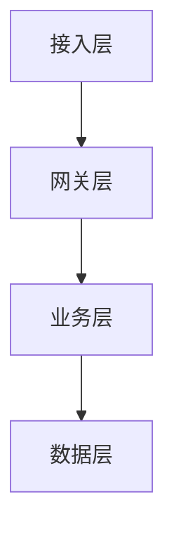

# 项目需求与背景

> **用途**：新项目启动时的第一份文件。把项目背景、需求拆解、架构图谱、协议全部写清。
> **填写人**：人类（可让 AI 协助起草，但**内容定稿必须人确认**）。
> **规则**：填到 `[待定]` 的项必须停下问人；定稿前必须过第 6 节澄清环节；无 `[待定]` 残留才可进入编码阶段。

---

## 0. 项目元信息

| 项 | 内容 |
|---|---|
| 项目名 | `[待定]` |
| 一句话定位 | `[待定]`（给谁用、解决什么） |
| 技术栈（可选） | `[待定]` |
| 启动日期 | `[待定]` |
| 关联可复用资产 | `[待定]`（本项目会用到哪些 MCP / skill / prompt） |

---

## 1. 项目背景（为什么做）

> 写 3-6 句：现状痛点、目标用户、核心价值、成功标志。

- 现状与痛点：`[待定]`
- 目标用户：`[待定]`
- 我们要做成什么样：`[待定]`
- 成功标志（怎么算这个项目成功）：`[待定]`

## 2. 需求拆解

### 2.1 核心使用路径（用户从进入到拿到结果走几步）

```
[待定]（例：用户提问 → 网关路由 → 对应 Agent 回答 → 流式返回 → 结果入库）
```

### 2.2 功能清单（编码时逐项勾选，实现一个勾一个）

- [ ] `[待定]` 功能 1（描述 + 关键行为）
- [ ] `[待定]` 功能 2
- [ ] `[待定]` 功能 3

### 2.3 边界（明确不做 / 非目标）

- `[待定]`（例：本次不做支付；不做多租户）

---

## 3. 架构图谱

> 文字版架构图：分层、模块、数据流、依赖。先写清楚，编码时 AI 严格按此搭骨架。
> 可用 Mermaid 代码块（后续渲染成图）。



### 3.1 分层与模块

| 层 | 模块 | 职责 | 禁止 |
|---|---|---|---|
| `[待定]` | `[待定]` | `[待定]` | `[待定]` |

### 3.2 数据流

- `[待定]`（例：请求 → 校验 → 服务 → DB → 响应；关键路径画出来）

### 3.3 依赖关系

- 外部依赖（DB / Redis / 第三方 API / 模型）：`[待定]`
- 内部依赖（本仓库模块间）：`[待定]`

### 3.4 架构约束注入（审查前置，必填）

> 对应 `../03-支撑资产/ARCHITECTURE_RULES.md`，把下面几项在编码前定下来，写骨架时注入给 AI：

- **事务边界**：哪些操作「写库 + 外部调用」（发短信/发 Token/调三方）？必须声明事务包裹方案：`[待定]`
- **并发竞争点**：扣减/累加/抢锁/幂等建单发生在哪？对策（乐观锁 Version / 分布式锁 / 幂等键）：`[待定]`
- **成熟库选用**：限流 / JWT / 健康检查 / ORM 用哪个社区库（禁止自研底层）：`[待定]`
- **密码处理策略**：>72 字节密码怎么处理（拒绝 400 或 SHA-256 预处理）：`[待定]`

---

## 4. 协议（协议先行）

> 编码前先把「接口长什么样」定死，AI 按协议实现，人按协议验收。

### 4.1 接口协议

| 接口 | 方法/路径 | 请求体 | 响应体 | 错误码 |
|---|---|---|---|---|
| `[待定]` | `[待定]` | `[待定]` | `[待定]` | `[待定]` |

### 4.2 数据协议（表 / 对象结构）

| 对象 | 字段 | 类型 | 约束 |
|---|---|---|---|
| `[待定]` | `[待定]` | `[待定]` | `[待定]` |

### 4.3 鉴权与权限协议

- 认证方式：`[待定]`（JWT / Session / OAuth）
- 权限模型：`[待定]`（角色 / 租户 / 公开）
- 密钥来源：`[待定]`（走安全目录 .env，fail loudly）

### 4.4 错误码约定

- 格式：`[待定]`（例：`模块_错误` 全大写）
- 列表：`[待定]`

---

## 5. 可复用资产清单（投喂给 AI）

> 编码前把本项目会用到的资产列出，编码-prompt 会引用此处。

| 资产 | 路径（相对 `可复用资产/`） | 用途 |
|---|---|---|
| `[待定]` | `[待定]` | `[待定]` |

---

## 6. 澄清环节（定稿前必过）

> 被动等 `[待定]` 被发现是防守；主动挑出「没说清的地方」才是澄清（借鉴 GitHub spec-kit 的 clarify 命令）。
> 做法：定稿前让 AI 以「实现者」身份通读本文件与 `模板-02`，系统性列出所有模糊/矛盾/缺失点，
> 逐个问答、由人拍板，并把结论写回正文对应章节；本表只做记录，正文不留 `待定` 状态。

### 6.1 澄清问答记录

| # | 模糊点（AI 挑出的问题） | 影响章节 | 结论（人拍板，已写回正文） | 状态 |
|---|---|---|---|---|
| 1 | `[待定]`（例：登录连续失败 5 次是锁定账号还是限流？） | `4.3 鉴权` | `[待定]` | `[待澄清/已澄清]` |
| 2 | `[待定]` | `[待定]` | `[待定]` | `[待定]` |

### 6.2 遗留待确认（不阻塞定稿，但须有归属与期限）

- [ ] `[待定]`（例：是否接第三方登录——P2，MVP 后专项，由项目 owner 拍板）

> **定稿标志**：澄清问答无「待澄清」残留（或明确转为 6.2 遗留项）、无 `[待定]` 残留、
> 验收标准可推导、协议完整 → 本文件定稿，进入编码。
