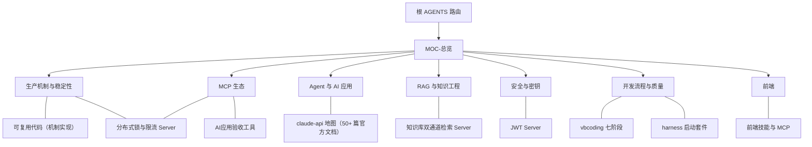

# 知识图谱总览（MOC）

> [!info] 用法
> 本目录是「可复用资产库」的知识图谱层：按主题把全库资产用双链织成网。
> 在 Obsidian 中把本目录作为 vault 打开，用图谱视图看全局结构，用反链面板跳转；
> 构建规范见 [[skill/知识库笔记写作/SKILL|知识库笔记写作]]。

## 库的骨架：同一能力的四种形态

全库资产源自同一生产项目（agent_gateway）的沉淀，同一机制通常以四种形态存在，这是图谱的主干结构：

1. **机制参考实现**（可运行 Python）：[[可复用代码/README|可复用代码]]
2. **能力封装**（MCP Server，任何 Host 可调用）：[[MCP sever/README|MCP sever]]
3. **方法论**（skill，教 AI 怎么做）：[[skill/README|skill]]
4. **流程与验收**：[[vbcoding全流程/README|vbcoding 全流程]]、[[harness/00-README|harness]]、[[AI应用验收工具/README|AI 应用验收工具]]

另有两大专项领域：[[AI应用资产/README|AI 应用资产]]（agent/RAG/选型/安全）与[[前端资产/README|前端资产]]（选型/技能/MCP）。

## 四条任务路线（按场景串起来的主线）

图谱不是拿来"看"的，是拿来"走"的。四条常用路线，每条都是一条可点击的链：

1. **从零启动一个新项目**：
   [[harness/AGENTS|harness 契约]] → [[harness/00-主人意图与使用方法|主人意图]] → [[harness/04-待人类填写/00-填写说明|填写四模板]] → [[vbcoding全流程/01-需求库/模板-01-项目需求与背景|需求与协议]] → [[vbcoding全流程/02-任务-prompt/编码-prompt|编码]] → [[vbcoding全流程/02-任务-prompt/审阅-prompt|审阅]] → [[harness/05-执行流程/04-交付报告模板|交付报告]]
2. **做一个生产级 AI 应用 / Agent**：
   [[AI应用资产/agent全链路|agent 全链路]] → [[AI应用资产/安全审计|安全审计（先于功能）]] → [[AI应用资产/skills/12-factor-agents/README|12-factor 原文]] → [[AI应用资产/选型清单|选型]] → [[skill/mcp-server开发五步法/SKILL|能力封装 MCP]] → [[AI应用验收工具/SKILL|五阶段验收]]
3. **做 RAG 知识问答**：
   [[AI应用资产/RAG构建|RAG 九环链路]] → [[MCP sever/知识库双通道检索/README|检索实现]] → [[MCP sever/语义缓存/README|语义缓存]] → [[skill/避坑检查清单/SKILL|检索类坑 #27-#32]] → [[AI应用验收工具/README|验收]]
4. **上线前生产化自查**：
   [[skill/生产机制自查/SKILL|24 项自查]] → [[可复用代码/README|缺什么机制补什么]] → [[vbcoding全流程/03-支撑资产/边界约束|红线对照]] → [[skill/密钥与配置治理/SKILL|密钥治理]] → [[AI应用验收工具/SKILL|一键验收]]

另有面试冲刺短线：[[skill/面试手写八段训练/SKILL|八段训练]] → [[可复用代码/README|对照实现]] → [[MCP sever/README|现场演示能力]]。

## 七大主题图谱

| 主题 MOC | 覆盖范围 |
|---|---|
| [[图谱/MOC-生产机制与稳定性]] | 锁 / 限流 / 熔断 / 缓存 / 幂等的四层实现与自查 |
| [[图谱/MOC-MCP生态]] | 5 个自研 Server + 开发五步法 + 官方最佳实践 + 前端 MCP |
| [[图谱/MOC-Agent与AI应用]] | agent 全链路 / 12-factor / claude-api / 选型清单 |
| [[图谱/MOC-RAG与知识工程]] | RAG 九环链路 / 双通道检索 / 语义缓存 / 纠错映射 |
| [[图谱/MOC-安全与密钥]] | 安全审计 / 密钥治理 / JWT / 边界约束 |
| [[图谱/MOC-开发流程与质量]] | vbcoding 七阶段 / harness 启动套件 / 避坑 / 验收 / 交付 |
| [[图谱/MOC-前端]] | 前端三层选型 / 官方前端技能 / 前端 MCP |

## 目录入口

权威路由在 [根 AGENTS.md](../AGENTS.md)（agent 必读）；人类浏览入口：

- [[vbcoding全流程/README|vbcoding全流程]]——日常开发流程（需求 / 编码 / 修 Bug / 审阅）
- [[harness/00-README|harness]]——新项目启动套件
- [[MCP sever/README|MCP sever]]——5 个可复用 MCP Server
- [[可复用代码/README|可复用代码]]——机制参考实现库
- [[skill/README|skill]]——技能库（6 件）
- [[AI应用资产/README|AI应用资产]]——agent / RAG / 选型 / 官方技能
- [[前端资产/README|前端资产]]——前端选型 / 技能 / MCP
- [[AI应用验收工具/README|AI应用验收工具]]——五阶段一键验收

## 维护约定

- 新资产入库：挂到对应主题 MOC；同一领域超过 3 篇必须建或更新 MOC（见写作规范）
- MOC 只放链接与一句话定位，细则回各自文件，避免两处漂移
